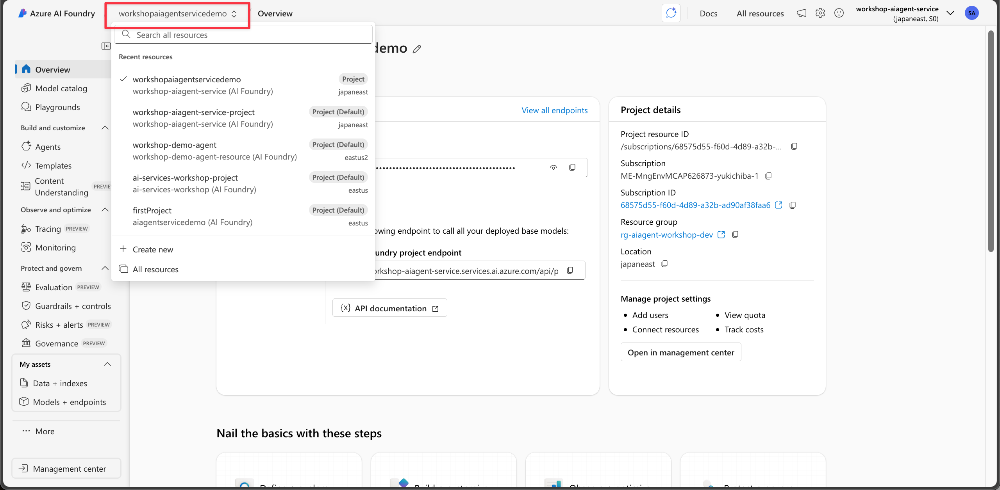
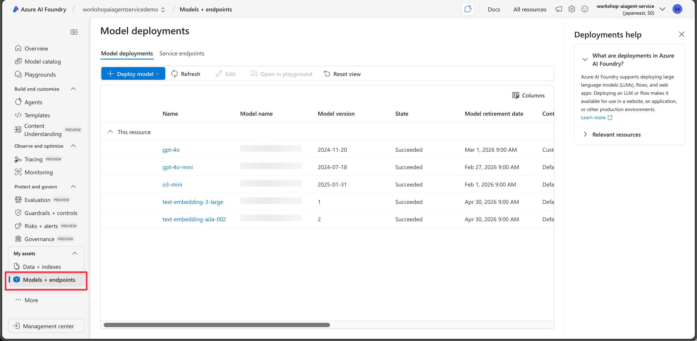

# Azure AI Agent Service Project Setup Guide

Before jumping into the hands-on labs, ensure you have the necessary Azure resources set up. This guide walks you through deploying the required infrastructure using Bicep templates and completing essential manual configurations. 

## 1. Infrastructure Setup

This is described in README.md in this repo. Please follow the instructions there to deploy the Bicep templates and create the required resources such as:
- Azure AI Agent Service
- Azure OpenAI
- Azure AI Search
- Logic App
- Key Vault
- Application Insights
- API Management

## 2. Project Configuration

create Azure AI Foundry Project and make sure to create connections to Azure OpenAI models such as GPT-4o/4o-mini.

In Azure Portal, open the Azure AI Agent Service account and Go to "Projects" tab, then create your own project.

When the project is created, Click "Go to Azure AI Foundry"

In Azure AI Foundry portal, open your project.

Then, Make sure to deploy Azure OpenAI models.

