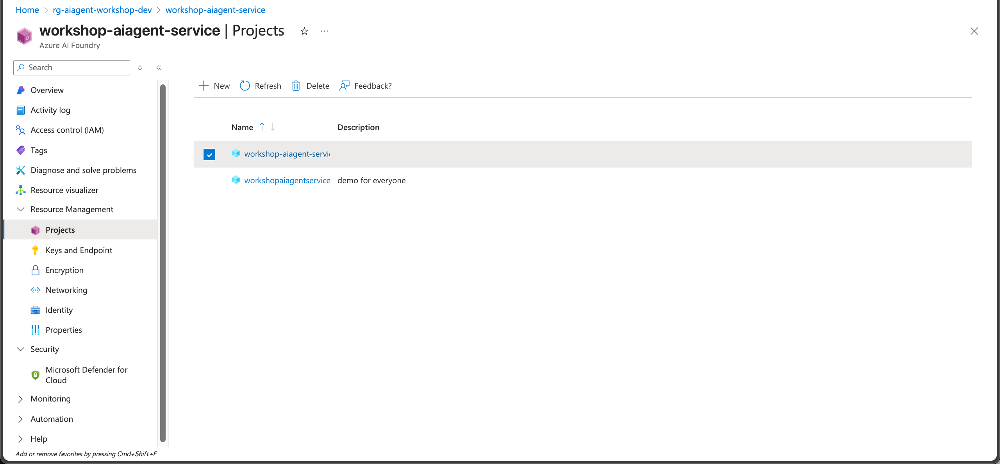
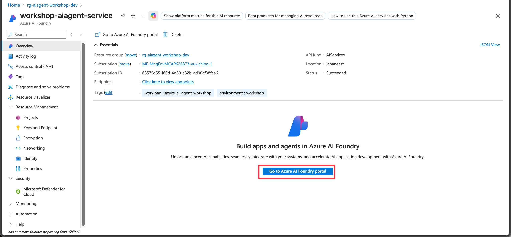
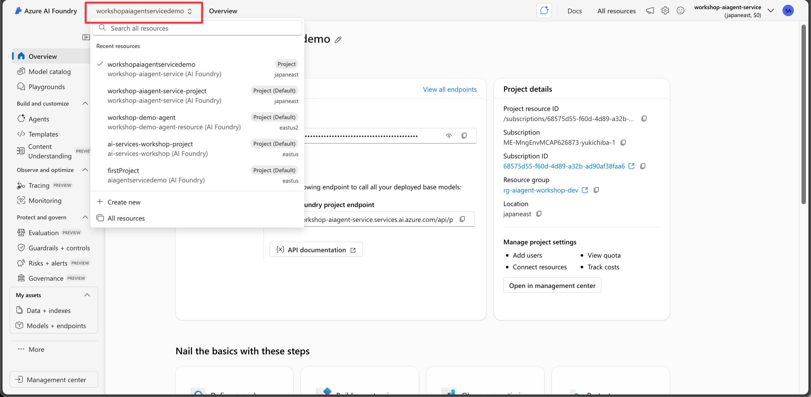
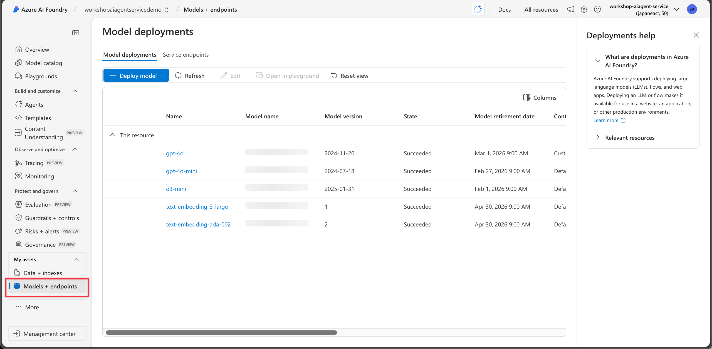

# Azure AI エージェントサービス プロジェクトセットアップガイド

ハンズオンラボに進む前に、必要な Azure リソースがセットアップされていることを確認してください。このガイドでは、Bicep テンプレートを使用したインフラストラクチャのデプロイ方法と、必要な手動設定の手順を説明します。

## 1. インフラストラクチャのセットアップ

この内容は本リポジトリの README.md に記載されています。README.md の指示に従い、Bicep テンプレートをデプロイして以下のリソースを作成してください。
- Azure AI エージェントサービス
- Azure OpenAI
- Azure AI Search
- Logic App
- Key Vault
- Application Insights
- API Management

## 2. プロジェクトの構成

Azure AI Foundry プロジェクトを作成し、GPT-4o/4o-mini などの Azure OpenAI モデルへの接続を必ず作成してください。

Azure ポータルで Azure AI エージェントサービスのアカウントを開き、「Projects」タブに移動してプロジェクトを作成します。

プロジェクト作成後、「Go to Azure AI Foundry」をクリックします。

Azure AI Foundry ポータルで自身のプロジェクトを開きます。

その後、Azure OpenAI モデルがデプロイされていることを確認してください。

